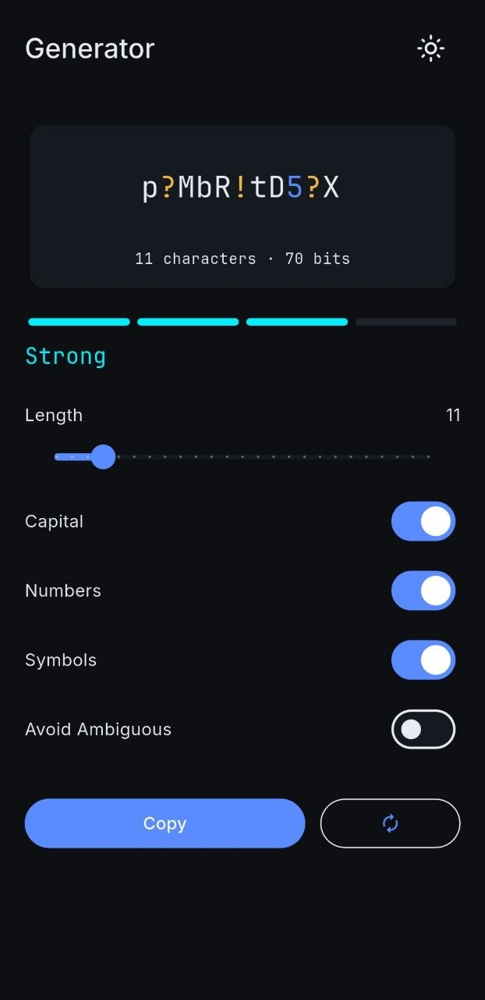
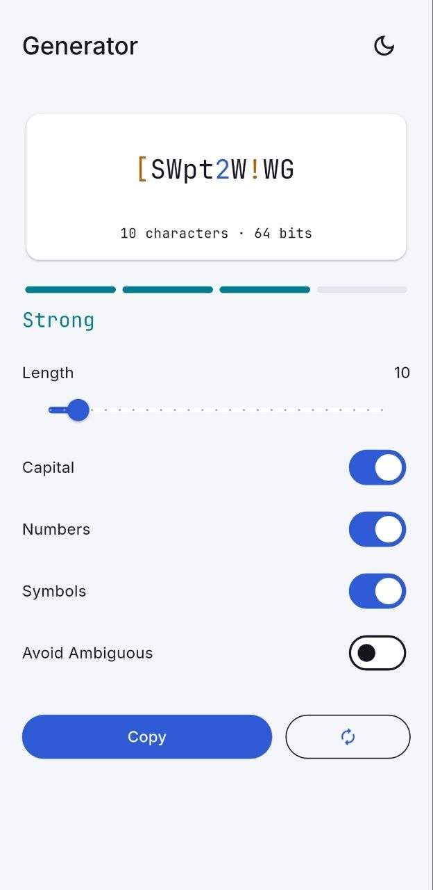
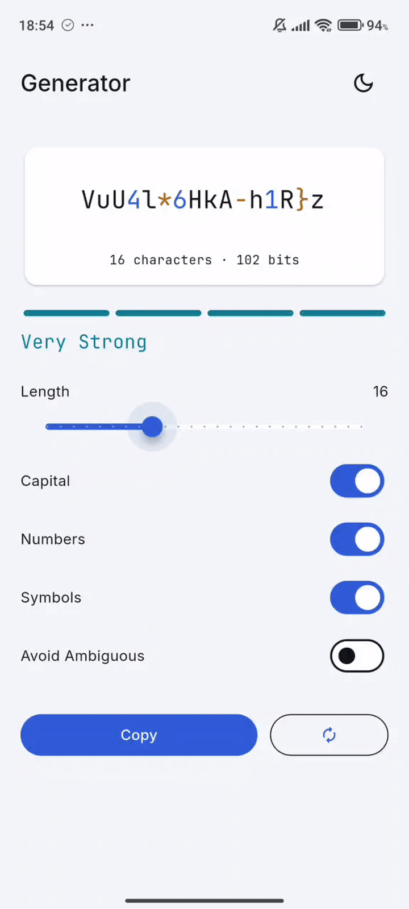

# PW Generator - built with Flutter

PW Generator - Secure Password Generator. A lightweight password generation app built with Flutter, designed to create strong and customizable passwords locally.

## Features

* **Password generation:** generate secure random passwords instantly
* **Customization:** choose password length and the character types to include
* **Character options:** uppercase letters, lowercase letters, numbers and symbols
* **Password strength:** visual indication of password complexity
* **Copy to clipboard:** quickly copy generated passwords for use elsewhere
* **Offline:** password generation works entirely locally without requiring an internet connection
* **Cross-platform:** built with Flutter and designed to run on supported Flutter platforms

## Privacy

PW Generator runs entirely on your device.

Generated passwords are not sent to a server, uploaded to the cloud or stored remotely. The app does not require an account or an internet connection to generate passwords.

Built by RebelTailor. All rights reserved.

## Screenshots

 
